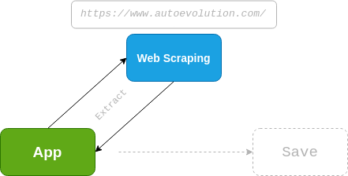
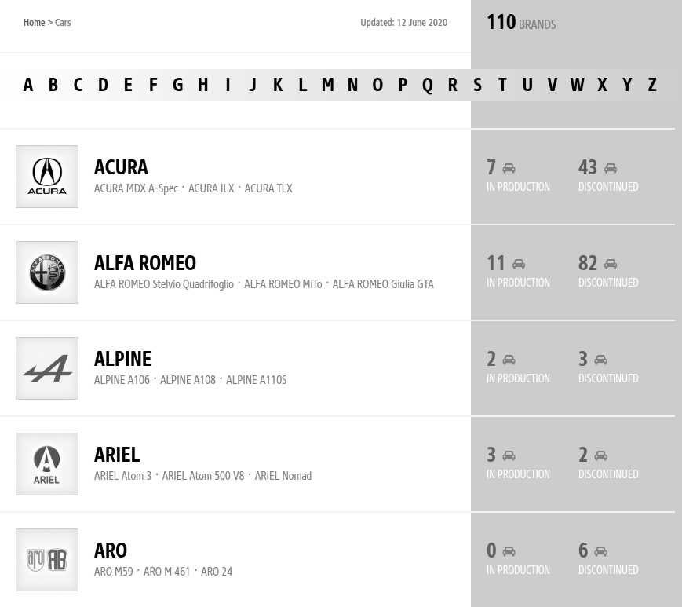
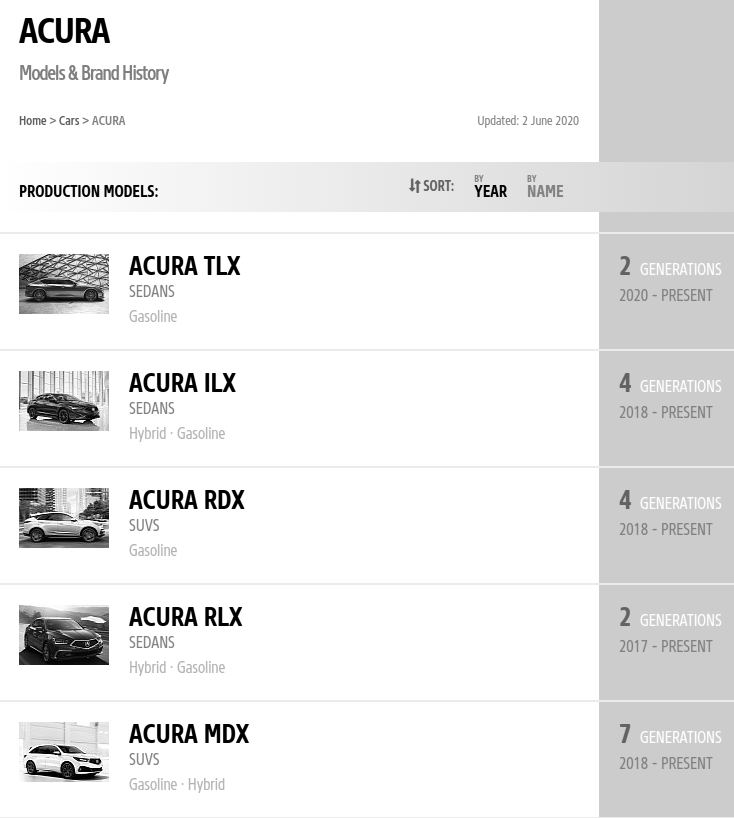
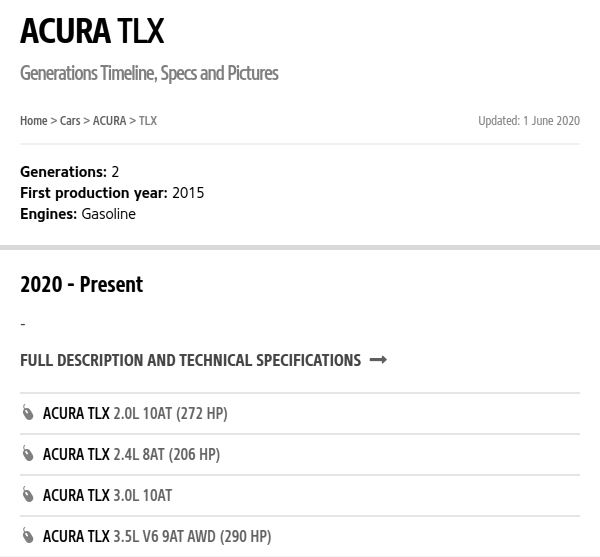
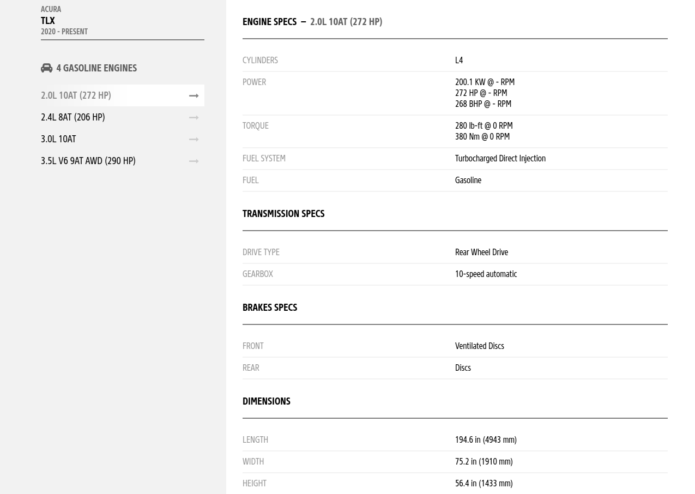

# Scapauto

Tool for extract information of page X, the objective is make a database 
of autos for future works. Actually the project support to extract of 
data and save in format JSON.

The information extracted from the page covers the following sections:

- The main page, where is the list of trademark
- The trademark page, where is the list of trademark's autos
- The generation page, where is the list of generations of vehicle 
 (in production and discontinued)
- The engine page, where is the list of engines of each generation 

    
    
    
    

